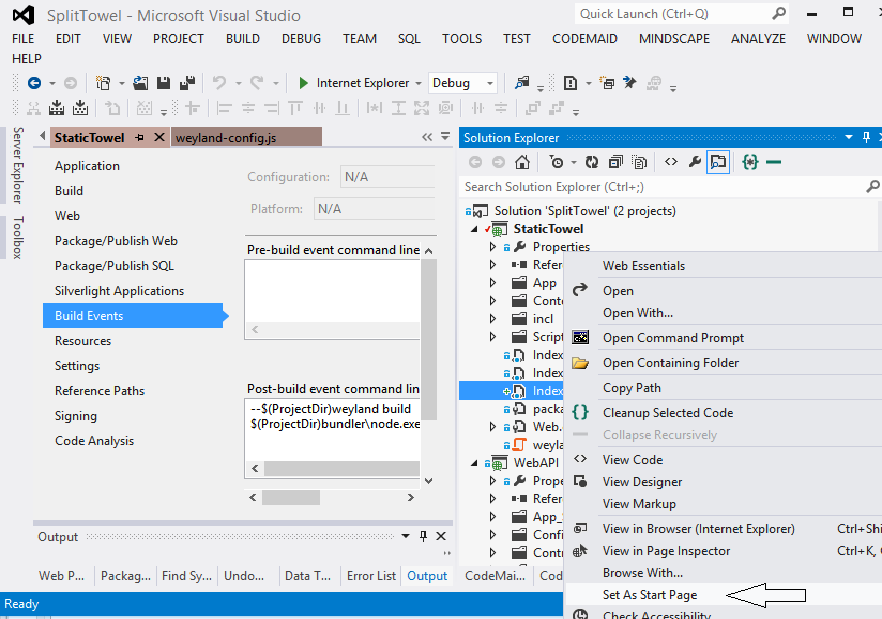

Split Towel
=======================

This is a modified version of John Papa’s Hot Towel and the sister project TypeTowel (Hot Towel with TypeScript).

The purpose of this version is to make clear split between the client-html/JavaScripts and the Web-API server.  
The client part is now static web. This makes it much easier to deploy the client solution. The html-client and the Web-API server can be deployed on two different servers. For example we can now with little modification, place the client within content management system running on PHP on Linux.

Cors:
------
The server side Web-API now includes cors handling (Cross-origin resource sharing) to enable the client and server to run on separate websites.  
The web.config file in the WebAPI project includes section to set-up the client website the cors controller will accept requests from.

Bundling:
---------
Instead of using the .Net Web Optimization Framework, Hot Towel demonstrates, we now use open source bundler solution to bundle and minify CSS and JavaScripts when the web project is compiled.  
*Note: the build folder for the bundle ("bundler") is not visible from the project solution explorer. It is just a folder that ships with the solution.*

App.ts:
-------
Application module is introduced to make it easier to handle the viewmodel for the app/shell.  
The app.ts also includes menu object to handle the main menu.

Web-API 2:
--------
The Web-API has been updated to use Web-API 2 and Breeze server for Web-API 2  
For demonstration the details page includes example of retrieving data (list of countries) from the Web-API.

Requirements: 
-------------

1. Visual studio 2012
2. TypeScript, latest version, currently 0.9.1.1 

Durandal Weyland Compile (Optional)
-----------------------------------
Would you like to build the project into just 4 files?  
Well you can do that using the Durandal weyland compile to compile the entire App directory plus the required Durandal scripts into one file.
To do this you need to install **node.js** and the **weyland package** for node.js.  
*Note: you only have to do the following set-up process if you intend to modify the project and compile the changes for weyland. You can still run the original weyland file that ships with the project by running the index_weyland.html page.*   
See here for directions for how to set-up weyland compile: [http://durandaljs.com/documentation/Building-with-Weyland/](http://durandaljs.com/documentation/Building-with-Weyland/ "Durandal weyland documentation")  
The node.js can be installed from here:
[http://nodejs.org/download/](http://nodejs.org/download/ "Download node.js")  
Then install the weyland plugin by running the following command line:
> npm install -g weyland  

Finally uncomment the post-build weyland command line:   
*Note: do not reverse the order of the two commands since it will cause the weyland build to be run by wrong note.exe file.*

The 3 index files:
------------------
The project includes 3 index html files.  Those are identical except they refer different CSS and JavaScripts:  
1. **index.html** - this is the debug version that includes each CSS and js file individually.  
2. **index_bundle.html** - this is the version that uses the bundled CSS and js files. What you would use for your deployment.  
3. **index_weyland.html** - this is the weyland compiled version.  This will cause the browser to load only 4 different files from the client!!:
The index page - index_weyland.html, bundled CSS file - /incl/splittowel.min.css, bundled javascript library file - /incl/splittowel.min.js, the Durandal app file - /App/main-built.js and the Durandal icon - /Content/images/icon.png

Small tip:
----------
Remember that in Visual Studio you can set the start-page for web application:

Tags:
-----
HotTowel, TypeTowel, Durandal, TypeScript, Cors, Web-API, Breeze, Bundling
 
 
